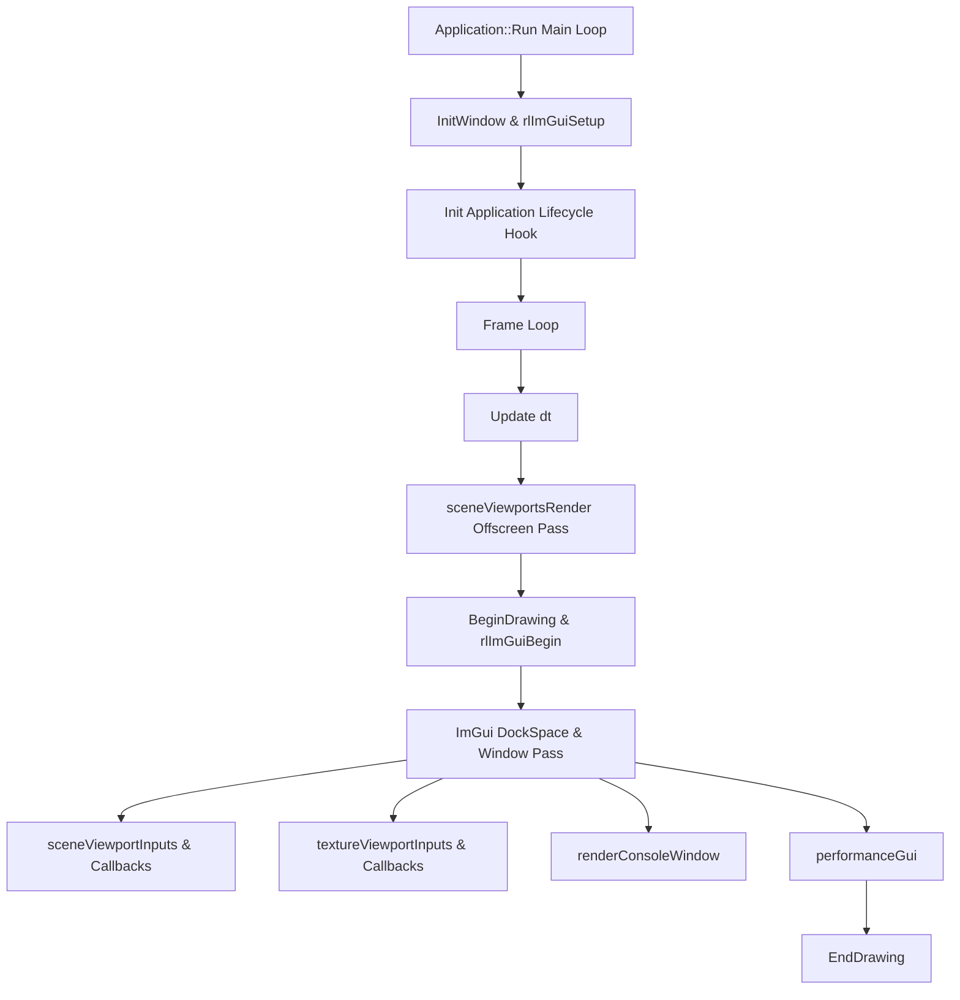

# Editor Framework Architecture & Developer Guidelines

Welcome to the **WorldBuilder Editor Framework**. This guide provides complete technical guidelines on how to inherit, configure, and extend the engine's core `Application` architecture.

---

## 1. Architectural Overview

The framework is built on **Raylib** for 3D/2D rendering and **Dear ImGui (Docking Branch)** for window management and docking layouts.



### Core Features
- **Polymorphic Application Class**: Derive from [`Application`](file:///home/mukes/dev/C++/Projects/editor/src/includes/Application.hpp#L8) to create custom editors, games, or visualization tools.
- **Dynamic Scene Viewports**: Create isolated 3D or 2D render targets with independent draw callbacks and input handlers.
- **Dynamic Texture Viewports**: View disk images or Raylib textures with `reloadCallback` support and `Ctrl+R` hotkey reloading.
- **Native ImGui Docking**: Complete docking, tabbing, and splitting support automatically saved to `imgui.ini`.
- **Render Optimization**: Offscreen scene framebuffers render **only when visible, hovered, or active**, consuming zero GPU cycles when hidden.
- **Thread-Safe Console Logging**: Automatic Raylib trace log redirection with `ConsoleLog` filtering and time-stamping.

---

## 2. Quick Start: Creating a Custom Application

To build an application using the framework, inherit from `Application` and override the virtual lifecycle hooks:

```cpp
#include "Application.hpp"
#include "raylib/raylib.h"

class MyEditorApp : public Application {
private:
    Camera3D camera3D = { 0 };

protected:
    void Init() override {
        // 1. Setup Camera
        camera3D.position = (Vector3){ 0.0f, 6.0f, 10.0f };
        camera3D.target   = (Vector3){ 0.0f, 0.0f, 0.0f };
        camera3D.up       = (Vector3){ 0.0f, 1.0f, 0.0f };
        camera3D.fovy     = 45.0f;
        camera3D.projection = CAMERA_PERSPECTIVE;

        // 2. Register a 3D Scene Viewport
        AddSceneViewport(
            "3D Viewport",
            [this]() {
                BeginMode3D(camera3D);
                    DrawCubeWires({ 0.0f, 0.0f, 0.0f }, 2.0f, 2.0f, 2.0f, RED);
                    DrawGrid(10, 1.0f);
                EndMode3D();
            },
            [this](SceneViewport& svp, float dt) {
                if (IsMouseButtonDown(MOUSE_BUTTON_LEFT)) {
                    // Update camera based on mouse movement
                }
            }
        );

        // 3. Register a Texture Viewport with Reload Callback
        AddTextureViewport(
            myTex,
            "Procedural Noise Preview",
            [this]() -> Texture2D {
                // Return newly re-generated or re-baked GPU texture
                return GenerateMyNoiseTexture();
            },
            true, // ownsTexture
            true  // canClose
        );
    }

    void Update(float deltaTime) override {}
    void Shutdown() override {}

public:
    MyEditorApp() : Application(1280, 720, "My Custom Editor") {}
};

int main() {
    MyEditorApp app;
    app.Run();
    return 0;
}
```

---

## 3. Working with Scene Viewports

The framework manages viewports using the [`SceneViewport`](file:///home/mukes/dev/C++/Projects/editor/src/includes/utils.hpp#L7) structure defined in [`utils.hpp`](file:///home/mukes/dev/C++/Projects/editor/src/includes/utils.hpp).

### 3.1 Viewport State Fields
| Field | Type | Description |
| :--- | :--- | :--- |
| `name` | `std::string` | Title displayed on the ImGui window/tab header. |
| `isVisible` | `bool` | `true` if the ImGui tab is currently active & visible on screen. |
| `isHovered` | `bool` | `true` if the mouse cursor is physically inside the viewport bounds. |
| `isActive` | `bool` | `true` while the mouse is held down after clicking inside the viewport. |
| `mousePosNorm` | `Vector2` | Normalized mouse coordinates $(u, v \in [0.0, 1.0])$ within the viewport. |
| `mousePosLocal` | `Vector2` | Local pixel mouse coordinates $(x, y)$ relative to viewport top-left. |

---

## 4. Working with Texture Viewports & Hot-Reloading

The framework manages texture inspection using [`TextureViewport`](file:///home/mukes/dev/C++/Projects/editor/src/includes/utils.hpp#L34).

### 4.1 Registering Texture Viewports
- **From Disk**: `AddTextureViewport("assets/wood.png");`
- **From Code / Callback**: `AddTextureViewport(initialTex, "Noise Preview", reloadLambda, ownsTexture);`

### 4.2 Hotkey Refresh (`Ctrl + R`)
When a Texture Viewport window is **visible on screen and focused/hovered**, pressing **`Ctrl + R`** immediately triggers:
1. Re-reading the file from disk (for file-based textures), OR
2. Invoking the registered `reloadCallback()` (for procedural textures).
3. Safely unloading the old GPU texture (`UnloadTexture`) and uploading the new texture into VRAM.

---

## 5. Console Logging Guidelines

Log messages from anywhere in your codebase using `ConsoleLog::Get()`:

```cpp
#include "ConsoleLog.hpp"

ConsoleLog::Get().AddLog(LogLevel::Info, "Loaded asset '%s' successfully.", assetPath);
ConsoleLog::Get().AddLog(LogLevel::Warning, "High memory usage detected: %d MB.", memUsage);
ConsoleLog::Get().AddLog(LogLevel::Error, "Failed to load shader file '%s'.", shaderPath);
```

Raylib's internal engine messages (`INFO`, `WARNING`, `ERROR`) are automatically redirected to `ConsoleLog` via `SetTraceLogCallback(RaylibTraceLogCallback)` during application startup.

---

## 6. Build Instructions

```bash
# Configure & compile
cmake -B build && cmake --build build

# Run testing executable
./build/testing
```
